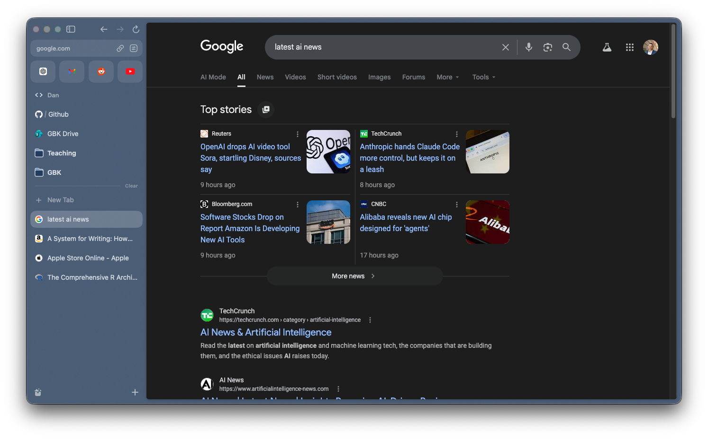
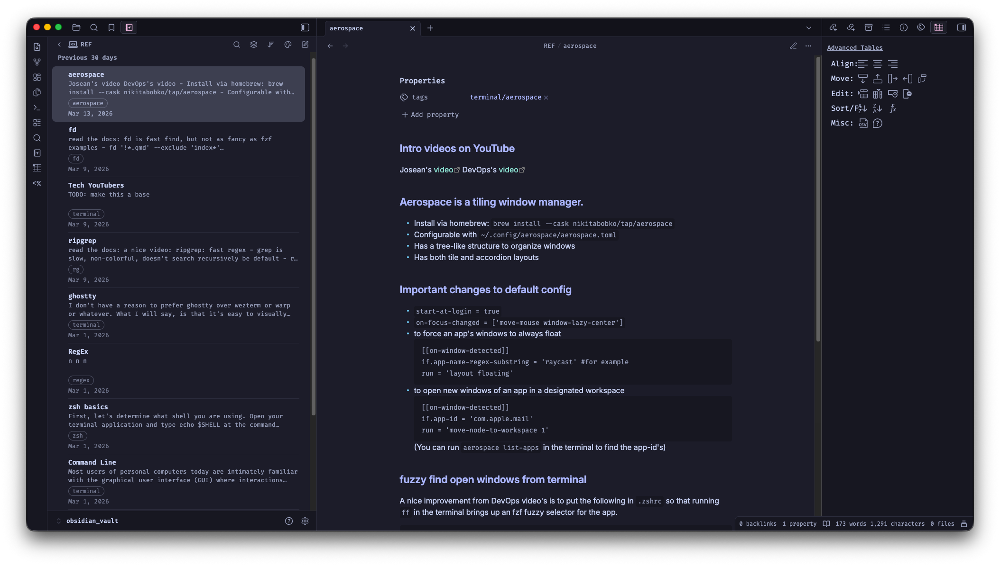
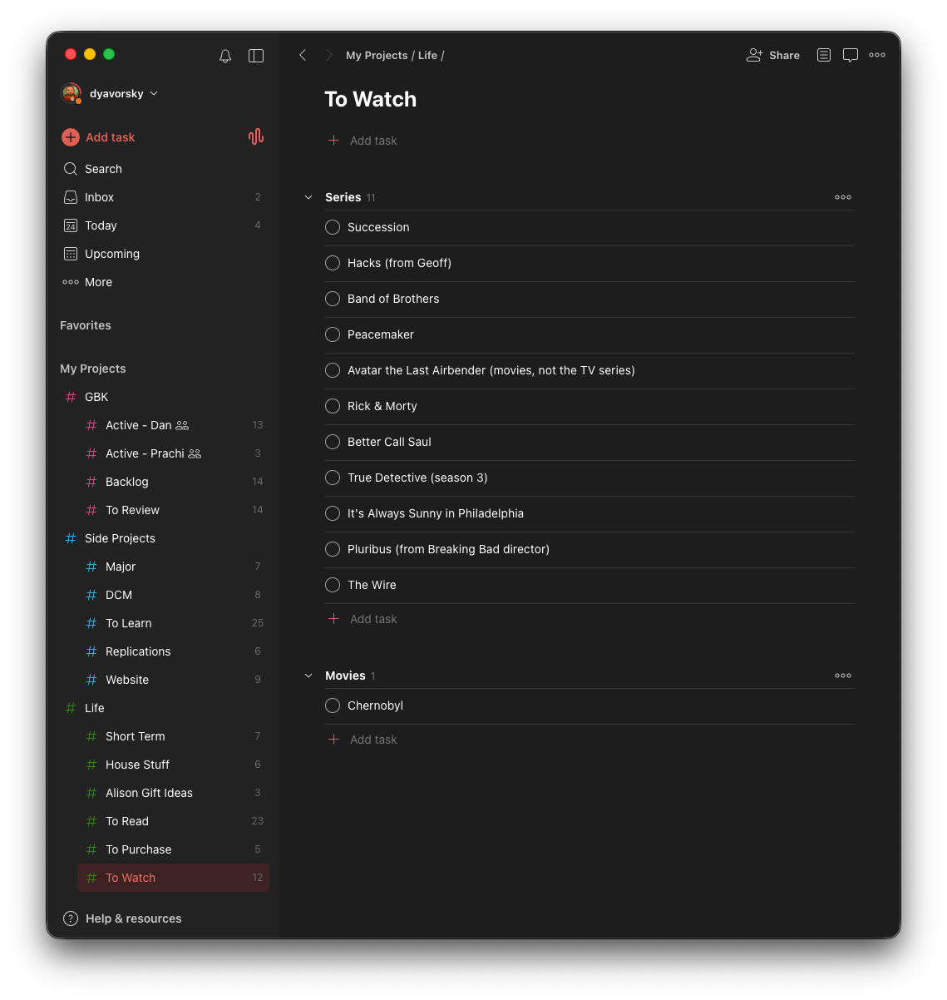

# Dev Tools

These each have their own posts:

 - [Positron & RStudio](../002-positron/) -- my IDEs
 - [Terminal & Shell](../003-terminal/) -- Ghostty, zsh, and CLI tools
 - [Neovim](../004-neovim/) -- a work in progress

I'm an **R** guy, but an aspiring user of Python and Julia.

I prefer **Quarto** wherever possible; Latex as a backup. Maybe someday Typst will enter the picture.

-----

# Communication & Calendar

 - **Outlook** for email and calendar.
 - **Slack** for team messaging
 - **Zoom** for video calls

A natural question is why not Apple's default Mail and Calendar apps since using Outlook anywhere (but especially on a Mac) is heresy: the Mail app doesn't use Command+Enter to send a message and re-mapping the keyboard shortcut in Settings is unreliable, and the Calendar app lacks Zoom integration.

-----

# Desktop Environment

:::: {.columns}

::: {.column width="45%"}

 - **[Arc](https://arc.net/)** as my browser of choice 
     - Side tabs!
 - **[AeroSpace](https://github.com/nikitabobko/AeroSpace)** for tiling window management
     - Everything in it's place with keyboard shortcuts to navigate
 - **[Vimium](https://chromewebstore.google.com/detail/vimium/dbepggeogbaibhgnhhndojpepiihcmeb)** browser extension for keyboard-only navigation

I aggressively edit keyboard shortcuts on my mac. I find most of the defaults unnecessary, which I disable. I heavily utilize speech-to-text and screenshots. I enable Vim motions wherever possible.

:::

::: {.column width="5%"}
:::

::: {.column width="50%"}

:::

::::

-----

# Writing & Notes

:::: {.columns}

::: {.column width="45%"}

 - **[Obsidian](https://obsidian.md/)** for notes
    - I'm not a full SecondBrain-Zettelkasten user, but I love the premise of markdown-based inter-linked notes, and of having complete local control of the content
 - **[Typora](https://typora.io/)** for markdown in a minimal editor 
    - This is unnecessary given my use of Positron, Neovim, and Obsidian, but it's pretty and minimal
 - **[Zotero](https://www.zotero.org/)** for tracking academic literature. 
    - While not perfect, it's substantially better than a system based on sub-directories and verbose file names

:::

::: {.column width="5%"}
:::

::: {.column width="50%"}

:::

::::

-----

# Utilities

:::: {.columns}

::: {.column width="45%"}

 - **[Todoist](https://todoist.com/home)** to track things that need to get done. There's a version for every device and as backup it's accessable from a browser
 - **[LastPass](https://www.lastpass.com/)** is my password manager. If you don't have one yet, you won't believe how much simpler and more secure authentication can be

Don't let their position at the bottom of this post deminish their utility. I use these hourly.

:::

::: {.column width="10%"}
:::

::: {.column width="35%"}

:::

::: {.column width="10%"}
:::

::::

