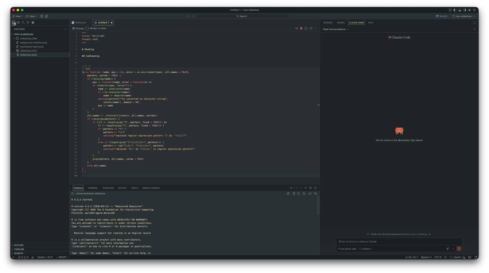
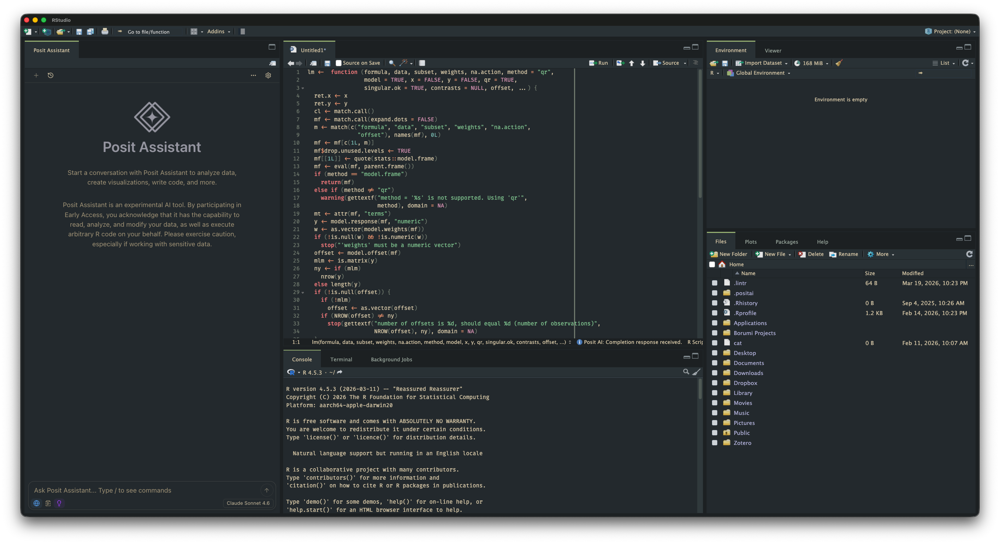

## Positron

[Positron](https://positron.posit.co/) is my most-used application. My current customizations include:

 - **Theme:** Everforest Dark with hard contrast 
    - `darkContrast: "hard"`
    - `highContrast: true`
    - `darkWorkbench: "high-contrast"`
 - **Icon theme:** Catppuccin Frappe
 - **Font:** MesloLGS NF (a Nerd Font with powerline/icon glyphs)
 - **Vim emulation** via the VsCodeVim extension, with smart relative line numbers and system clipboard integration
 - **Claude Code** in the panel
 - **Activity bar** positioned at the top

## RStudio

For the visual look of [RStudio](https://posit.co/products/open-source/rstudio/), I use the Everforest-Hard editor theme from Garrick Aden-Buie's [rsthemes](https://github.com/gadenbuie/rsthemes) package, along with the [Fira Code](https://github.com/tonsky/FiraCode) font for fancy ligatures.

