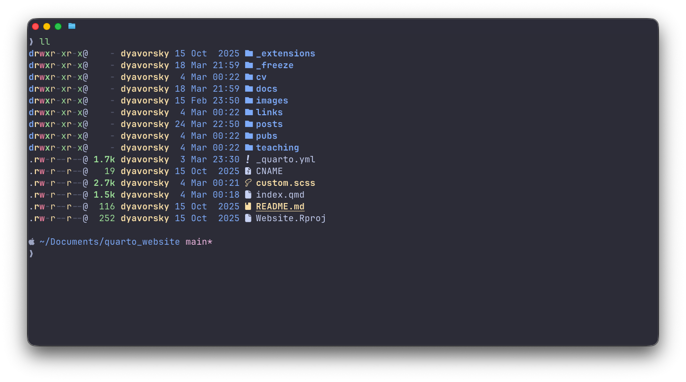

I want to be a person that sits on the command line, but I'm just not.  

For the rare times that I do, I use the **[Ghostty](https://ghostty.org/)** terminal application with Mac's default **zsh** shell.

Start by getting **[Homebrew](https://brew.sh/)**, a package manager (ie, an app store you access from the terminal). This lets you install apps and utilities by typing a simple command `brew install fzf` instead of hunting for downloads online.

My preferred configurations include:

 - ghostty config: I use the [Catppuccin Mocha](https://catppuccin.com/) theme
 - prompt config: I use [Starship](https://starship.rs/), 
 - zsh config: 
    - [zsh-autosuggestions](https://github.com/zsh-users/zsh-autosuggestions)
    - [zsh-syntax-highlighting](https://github.com/zsh-users/zsh-syntax-highlighting)
    - [eza](https://github.com/z-shell/zsh-eza), a modern ls 
    - [bat](https://github.com/sharkdp/bat), a modern cat  
    - [ripgrep](https://github.com/BurntSushi/ripgrep), a modern grep
    - [fzf](https://github.com/junegunn/fzf), the ubiquitous fuzzy finder
    - [yazi](https://yazi-rs.github.io/), the visual file manager 
    - along with vim keybindings and a shortlist of aliases 
    
It's unremarkable. The config file can be found on my github [here](https://github.com/dyavorsky/configs).

